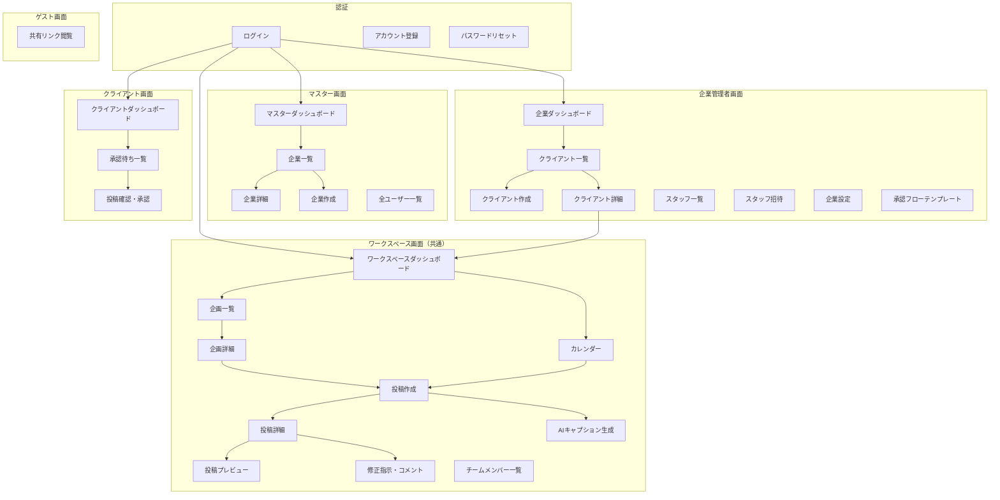
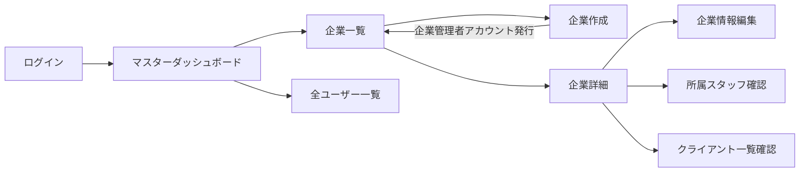
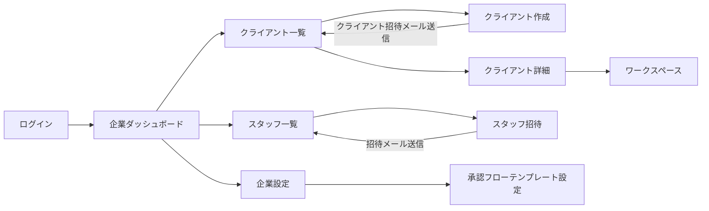
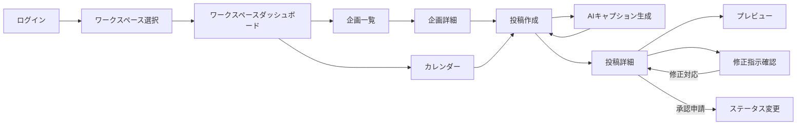
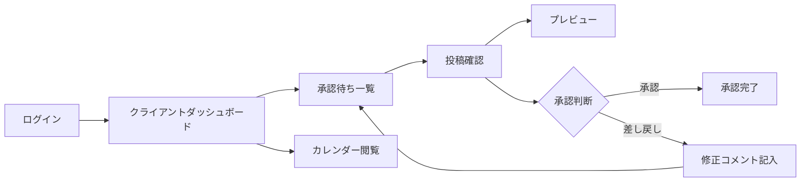
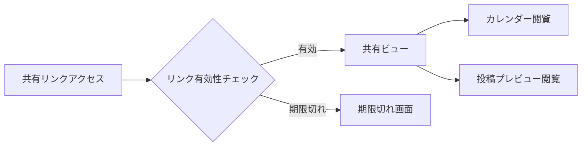
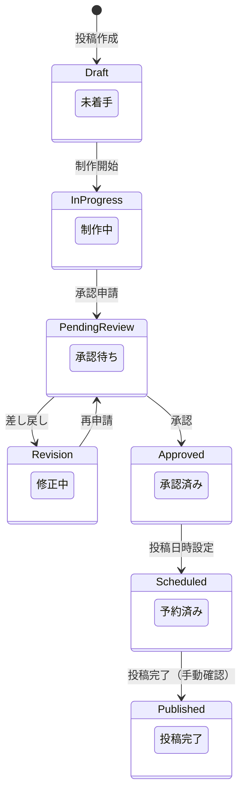
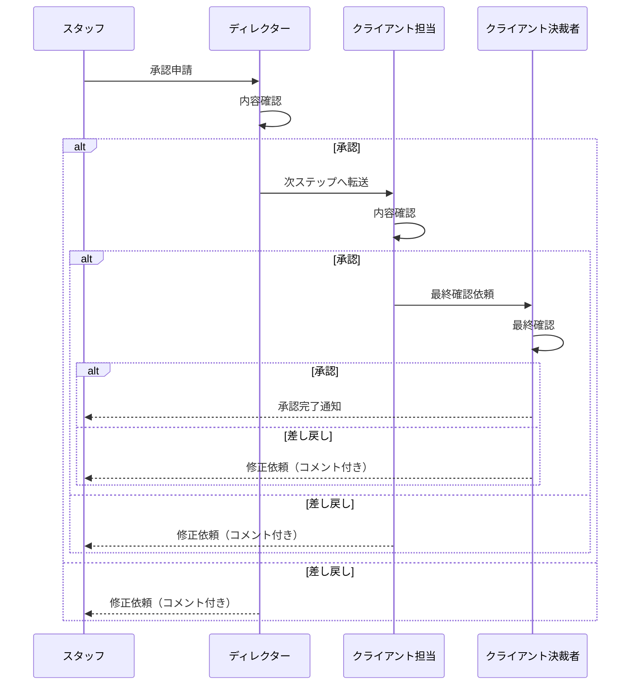

# APP_FLOW（画面遷移・決定フロー） - エスカン

## 1. 全体画面マップ



## 2. URL設計（ルーティング）

| パス | 画面 | 対象ロール |
|------|------|-----------|
| `/login` | ログイン | 未認証 |
| `/register` | アカウント登録 | 未認証 |
| `/forgot-password` | パスワードリセット | 未認証 |
| `/master` | マスターダッシュボード | マスター |
| `/master/organizations` | 企業一覧 | マスター |
| `/master/organizations/new` | 企業作成 | マスター |
| `/master/organizations/[orgId]` | 企業詳細 | マスター |
| `/master/users` | 全ユーザー一覧 | マスター |
| `/dashboard` | 企業ダッシュボード | 企業管理者 |
| `/clients` | クライアント一覧 | 企業管理者 |
| `/clients/new` | クライアント作成 | 企業管理者 |
| `/clients/[clientId]` | クライアント詳細（ワークスペーストップ） | 企業管理者 / スタッフ |
| `/clients/[clientId]/calendar` | カレンダー | 企業管理者 / スタッフ / クライアント |
| `/clients/[clientId]/campaigns` | 企画一覧 | 企業管理者 / スタッフ / クライアント |
| `/clients/[clientId]/campaigns/[campaignId]` | 企画詳細 | 企業管理者 / スタッフ / クライアント |
| `/clients/[clientId]/posts/new` | 投稿作成 | 企業管理者 / スタッフ |
| `/clients/[clientId]/posts/[postId]` | 投稿詳細 | 企業管理者 / スタッフ / クライアント |
| `/clients/[clientId]/posts/[postId]/preview` | 投稿プレビュー | 全ロール |
| `/clients/[clientId]/posts/[postId]/review` | 修正指示・コメント | 企業管理者 / スタッフ / クライアント |
| `/clients/[clientId]/team` | チームメンバー一覧 | 企業管理者 |
| `/staff` | スタッフ一覧 | 企業管理者 |
| `/staff/invite` | スタッフ招待 | 企業管理者 |
| `/settings` | 企業設定 | 企業管理者 |
| `/settings/approval-flow` | 承認フローテンプレート | 企業管理者 |
| `/approval` | 承認待ち一覧 | クライアント |
| `/shared/[token]` | ゲスト共有リンク閲覧 | ゲスト（未認証可） |

## 3. ロール別画面遷移フロー

### 3-1. マスターのフロー



**マスターの主な操作**:
1. ログイン後、マスターダッシュボードへ遷移
2. 企業一覧から新しい企業（代理店）を作成。この際、企業管理者のメールアドレスを入力して招待
3. 各企業の詳細を確認し、所属スタッフやクライアント数を俯瞰

### 3-2. 企業管理者のフロー



**企業管理者の主な操作**:
1. ログイン後、企業ダッシュボードへ（管理中クライアントの概要表示）
2. クライアント（ワークスペース）を新規作成し、クライアント担当者を招待
3. スタッフを企業に招待し、各クライアントのワークスペースに割り当て
4. 承認フローのテンプレートを設定（企業共通のデフォルトフロー）

### 3-3. スタッフのフロー



**スタッフの主な操作**:
1. ログイン後、所属ワークスペースの一覧から作業先を選択
2. カレンダーまたは企画一覧から投稿を作成
3. AIアシスタントでキャプションの下書きを生成
4. 素材のGoogle Drive URLを貼り付け
5. プレビューで仕上がりを確認
6. 承認申請（ステータスを「承認待ち」に変更）
7. クライアントからの修正指示を確認し、対応

### 3-4. クライアントのフロー



**クライアントの主な操作**:
1. ログインまたはメール通知のリンクからアクセス
2. 承認待ち一覧で未確認の投稿を確認
3. プレビューでSNSでの見え方をチェック
4. 承認ボタンで承認 or 差し戻し（修正コメント付き）

### 3-5. ゲスト（ログイン不要）のフロー



**ゲストの操作**:
1. 共有リンク（トークン付きURL）にアクセス
2. 有効期限・アクセス権の検証
3. 閲覧のみ可能（カレンダー、投稿プレビュー）

## 4. 投稿ステータス遷移図



### ステータス定義

| ステータス | 英名 | 説明 | 次のステータス |
|-----------|------|------|--------------|
| 未着手 | `draft` | 投稿が作成されたが制作未開始 | 制作中 |
| 制作中 | `in_progress` | スタッフが制作作業中 | 承認待ち |
| 承認待ち | `pending_review` | クライアントの承認を待っている状態 | 承認済み / 修正中 |
| 修正中 | `revision` | クライアントから差し戻され修正中 | 承認待ち |
| 承認済み | `approved` | クライアントが承認完了 | 予約済み |
| 予約済み | `scheduled` | 投稿日時が確定（手動設定） | 投稿完了 |
| 投稿完了 | `published` | SNSへの投稿が完了（手動確認） | - |

## 5. 承認フロー（多段階承認）



**承認フローのカスタマイズ**:
- 企業ごとに承認ステップ数と各ステップの担当ロールを定義可能
- 最小構成: スタッフ → クライアント（2ステップ）
- 最大構成: 制限なし（企業の運用に合わせて自由に設定）

## 6. 主要画面のレイアウト概要

### 6-1. サイドバーナビゲーション（共通）

```
┌─────────────────────────────────────────┐
│ [エスカン ロゴ]                           │
├─────────────────────────────────────────┤
│ ◆ ダッシュボード                         │
│ ◆ カレンダー                             │
│ ◆ 企画一覧                               │
│ ◆ 承認待ち（バッジ: 件数）               │
│ ────────────                             │
│ ◆ チーム                                 │
│ ◆ 設定                                   │
│ ────────────                             │
│ [ワークスペース切替]                      │
│   ├ クライアントA                         │
│   ├ クライアントB                         │
│   └ クライアントC                         │
└─────────────────────────────────────────┘
```

### 6-2. カレンダー画面

```
┌─────────────────────────────────────────────────────┐
│ ← 2026年2月 →     [月表示] [週表示]    [+ 投稿作成] │
├──────┬──────┬──────┬──────┬──────┬──────┬──────────┤
│ 月    │ 火    │ 水    │ 木    │ 金    │ 土    │ 日    │
├──────┼──────┼──────┼──────┼──────┼──────┼──────────┤
│      │      │      │ [投稿]│      │      │          │
│      │      │      │ ■承認 │      │      │          │
│      │      │      │  待ち │      │      │          │
├──────┼──────┼──────┼──────┼──────┼──────┼──────────┤
│ [投稿]│      │      │      │ [投稿]│      │          │
│ ■制作│      │      │      │ ■予約│      │          │
│  中  │      │      │      │  済み │      │          │
└──────┴──────┴──────┴──────┴──────┴──────┴──────────┘
```

### 6-3. 投稿詳細・プレビュー画面

```
┌──────────────────────┬──────────────────────────────┐
│ [SNS風プレビュー]     │ 投稿情報                      │
│                       │ ─────────                     │
│ ┌──────────────────┐ │ ステータス: [承認待ち]         │
│ │ @username         │ │ 企画: 2月度運用                │
│ │ ┌──────────────┐ │ │ 種別: [Instagram フィード ▼]   │
│ │ │              │ │ │ 投稿予定: 2026/02/20 18:00    │
│ │ │   画像/動画   │ │ │ 担当: 田中太郎                │
│ │ │   プレビュー  │ │ │                               │
│ │ │              │ │ │ キャプション                   │
│ │ └──────────────┘ │ │ ┌────────────────────────┐  │
│ │ ♥ 💬 ✈           │ │ │ ここにキャプションが...    │  │
│ │ キャプション...    │ │ │                            │  │
│ │ #tag1 #tag2       │ │ └────────────────────────┘  │
│ └──────────────────┘ │ [🤖 AIで下書き生成]            │
│                       │                               │
│ [Instagram] [TikTok]  │ 素材 (Google Drive)            │
│                       │ ┌────────────────────────┐  │
│                       │ │ 📎 drive.google.com/...    │  │
│                       │ └────────────────────────┘  │
│                       │                               │
│                       │ [承認申請] [保存]              │
├──────────────────────┴──────────────────────────────┤
│ 修正指示・コメント                                    │
│ ──────────────────                                   │
│ [田中] 2/15 10:00                                     │
│   画像2枚目のテキストを修正してください                │
│   対象: 画像2枚目 | ステータス: 未対応                 │
│                                                       │
│ [クライアント佐藤] 2/15 14:00                          │
│   色味をもう少し明るくお願いします                     │
│   対象: 画像1枚目 | ステータス: 対応済み               │
│                                                       │
│ [コメント入力欄...                        ] [送信]     │
└───────────────────────────────────────────────────────┘
```
