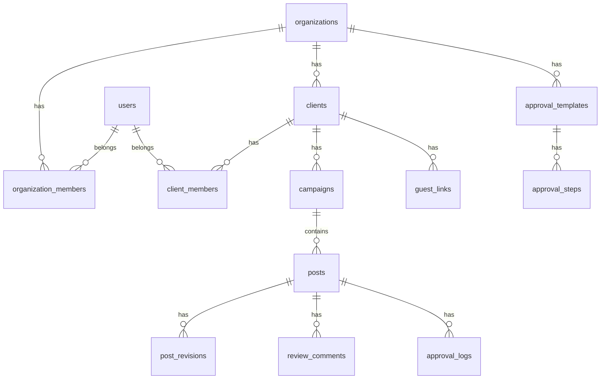
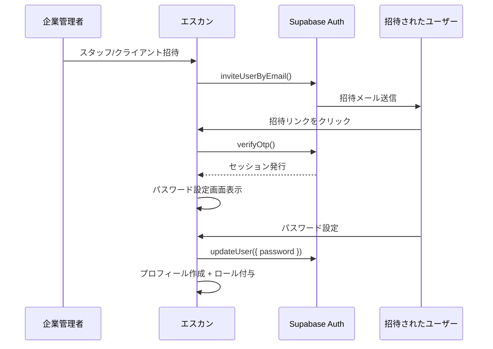
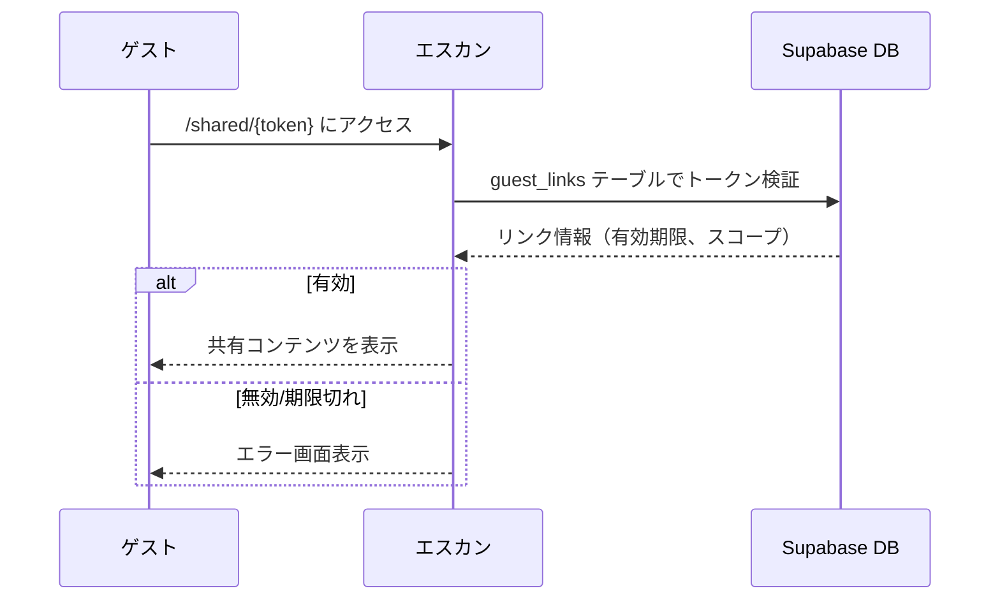

# BACKEND_STRUCTURE（バックエンド構造定義） - エスカン

## 1. データベーススキーマ

### ER図（概要）



### テーブル定義（SQL）

#### users（ユーザー）

Supabase Auth の `auth.users` を拡張するプロフィールテーブル。

```sql
CREATE TABLE public.users (
  id UUID PRIMARY KEY REFERENCES auth.users(id) ON DELETE CASCADE,
  email TEXT NOT NULL,
  full_name TEXT NOT NULL,
  avatar_url TEXT,
  system_role TEXT NOT NULL DEFAULT 'staff' CHECK (system_role IN ('master', 'agency_admin', 'staff', 'client')),
  is_active BOOLEAN NOT NULL DEFAULT true,
  created_at TIMESTAMPTZ NOT NULL DEFAULT now(),
  updated_at TIMESTAMPTZ NOT NULL DEFAULT now()
);

-- インデックス
CREATE INDEX idx_users_email ON public.users(email);
CREATE INDEX idx_users_system_role ON public.users(system_role);

-- トリガー: updated_at 自動更新
CREATE OR REPLACE FUNCTION update_updated_at()
RETURNS TRIGGER AS $$
BEGIN
  NEW.updated_at = now();
  RETURN NEW;
END;
$$ LANGUAGE plpgsql;

CREATE TRIGGER set_users_updated_at
  BEFORE UPDATE ON public.users
  FOR EACH ROW EXECUTE FUNCTION update_updated_at();
```

#### organizations（企業・代理店）

```sql
CREATE TABLE public.organizations (
  id UUID PRIMARY KEY DEFAULT gen_random_uuid(),
  name TEXT NOT NULL,
  slug TEXT NOT NULL UNIQUE,
  logo_url TEXT,
  description TEXT,
  is_active BOOLEAN NOT NULL DEFAULT true,
  created_by UUID REFERENCES public.users(id),
  created_at TIMESTAMPTZ NOT NULL DEFAULT now(),
  updated_at TIMESTAMPTZ NOT NULL DEFAULT now()
);

CREATE INDEX idx_organizations_slug ON public.organizations(slug);

CREATE TRIGGER set_organizations_updated_at
  BEFORE UPDATE ON public.organizations
  FOR EACH ROW EXECUTE FUNCTION update_updated_at();
```

#### organization_members（企業メンバー）

企業とユーザーの中間テーブル。スタッフは複数企業に所属可能。

```sql
CREATE TABLE public.organization_members (
  id UUID PRIMARY KEY DEFAULT gen_random_uuid(),
  organization_id UUID NOT NULL REFERENCES public.organizations(id) ON DELETE CASCADE,
  user_id UUID NOT NULL REFERENCES public.users(id) ON DELETE CASCADE,
  role TEXT NOT NULL DEFAULT 'staff' CHECK (role IN ('agency_admin', 'staff')),
  is_active BOOLEAN NOT NULL DEFAULT true,
  invited_at TIMESTAMPTZ NOT NULL DEFAULT now(),
  joined_at TIMESTAMPTZ,
  created_at TIMESTAMPTZ NOT NULL DEFAULT now(),
  updated_at TIMESTAMPTZ NOT NULL DEFAULT now(),
  UNIQUE(organization_id, user_id)
);

CREATE INDEX idx_org_members_org ON public.organization_members(organization_id);
CREATE INDEX idx_org_members_user ON public.organization_members(user_id);

CREATE TRIGGER set_org_members_updated_at
  BEFORE UPDATE ON public.organization_members
  FOR EACH ROW EXECUTE FUNCTION update_updated_at();
```

#### clients（クライアント = ワークスペース）

```sql
CREATE TABLE public.clients (
  id UUID PRIMARY KEY DEFAULT gen_random_uuid(),
  organization_id UUID NOT NULL REFERENCES public.organizations(id) ON DELETE CASCADE,
  name TEXT NOT NULL,
  slug TEXT NOT NULL,
  description TEXT,
  logo_url TEXT,
  sns_platforms TEXT[] DEFAULT '{}',
  instagram_username TEXT,
  tiktok_username TEXT,
  is_active BOOLEAN NOT NULL DEFAULT true,
  created_by UUID REFERENCES public.users(id),
  created_at TIMESTAMPTZ NOT NULL DEFAULT now(),
  updated_at TIMESTAMPTZ NOT NULL DEFAULT now(),
  UNIQUE(organization_id, slug)
);

CREATE INDEX idx_clients_org ON public.clients(organization_id);

CREATE TRIGGER set_clients_updated_at
  BEFORE UPDATE ON public.clients
  FOR EACH ROW EXECUTE FUNCTION update_updated_at();
```

#### client_members（クライアントチームメンバー）

スタッフやクライアント担当者をワークスペースに割り当てる中間テーブル。

```sql
CREATE TABLE public.client_members (
  id UUID PRIMARY KEY DEFAULT gen_random_uuid(),
  client_id UUID NOT NULL REFERENCES public.clients(id) ON DELETE CASCADE,
  user_id UUID NOT NULL REFERENCES public.users(id) ON DELETE CASCADE,
  role TEXT NOT NULL DEFAULT 'staff' CHECK (role IN ('staff', 'client')),
  is_active BOOLEAN NOT NULL DEFAULT true,
  invited_at TIMESTAMPTZ NOT NULL DEFAULT now(),
  joined_at TIMESTAMPTZ,
  created_at TIMESTAMPTZ NOT NULL DEFAULT now(),
  updated_at TIMESTAMPTZ NOT NULL DEFAULT now(),
  UNIQUE(client_id, user_id)
);

CREATE INDEX idx_client_members_client ON public.client_members(client_id);
CREATE INDEX idx_client_members_user ON public.client_members(user_id);

CREATE TRIGGER set_client_members_updated_at
  BEFORE UPDATE ON public.client_members
  FOR EACH ROW EXECUTE FUNCTION update_updated_at();
```

#### campaigns（企画）

```sql
CREATE TABLE public.campaigns (
  id UUID PRIMARY KEY DEFAULT gen_random_uuid(),
  client_id UUID NOT NULL REFERENCES public.clients(id) ON DELETE CASCADE,
  name TEXT NOT NULL,
  description TEXT,
  start_date DATE,
  end_date DATE,
  status TEXT NOT NULL DEFAULT 'active' CHECK (status IN ('active', 'completed', 'archived')),
  created_by UUID REFERENCES public.users(id),
  created_at TIMESTAMPTZ NOT NULL DEFAULT now(),
  updated_at TIMESTAMPTZ NOT NULL DEFAULT now()
);

CREATE INDEX idx_campaigns_client ON public.campaigns(client_id);
CREATE INDEX idx_campaigns_status ON public.campaigns(status);

CREATE TRIGGER set_campaigns_updated_at
  BEFORE UPDATE ON public.campaigns
  FOR EACH ROW EXECUTE FUNCTION update_updated_at();
```

#### posts（投稿データ）

```sql
CREATE TABLE public.posts (
  id UUID PRIMARY KEY DEFAULT gen_random_uuid(),
  client_id UUID NOT NULL REFERENCES public.clients(id) ON DELETE CASCADE,
  campaign_id UUID REFERENCES public.campaigns(id) ON DELETE SET NULL,
  title TEXT NOT NULL,
  caption TEXT,
  hashtags TEXT[] DEFAULT '{}',
  post_type TEXT NOT NULL DEFAULT 'feed' CHECK (post_type IN ('feed', 'reel', 'story', 'tiktok')),
  platform TEXT NOT NULL DEFAULT 'instagram' CHECK (platform IN ('instagram', 'tiktok')),
  status TEXT NOT NULL DEFAULT 'draft' CHECK (status IN ('draft', 'in_progress', 'pending_review', 'revision', 'approved', 'scheduled', 'published')),
  scheduled_at TIMESTAMPTZ,
  published_at TIMESTAMPTZ,
  media_urls TEXT[] DEFAULT '{}',
  media_type TEXT CHECK (media_type IN ('image', 'video', 'carousel')),
  assigned_to UUID REFERENCES public.users(id),
  current_approval_step INT DEFAULT 0,
  created_by UUID REFERENCES public.users(id),
  created_at TIMESTAMPTZ NOT NULL DEFAULT now(),
  updated_at TIMESTAMPTZ NOT NULL DEFAULT now()
);

CREATE INDEX idx_posts_client ON public.posts(client_id);
CREATE INDEX idx_posts_campaign ON public.posts(campaign_id);
CREATE INDEX idx_posts_status ON public.posts(status);
CREATE INDEX idx_posts_scheduled ON public.posts(scheduled_at);
CREATE INDEX idx_posts_assigned ON public.posts(assigned_to);

CREATE TRIGGER set_posts_updated_at
  BEFORE UPDATE ON public.posts
  FOR EACH ROW EXECUTE FUNCTION update_updated_at();
```

#### post_revisions（投稿リビジョン）

投稿の変更履歴を記録。

```sql
CREATE TABLE public.post_revisions (
  id UUID PRIMARY KEY DEFAULT gen_random_uuid(),
  post_id UUID NOT NULL REFERENCES public.posts(id) ON DELETE CASCADE,
  revision_number INT NOT NULL,
  caption TEXT,
  hashtags TEXT[] DEFAULT '{}',
  media_urls TEXT[] DEFAULT '{}',
  change_summary TEXT,
  created_by UUID REFERENCES public.users(id),
  created_at TIMESTAMPTZ NOT NULL DEFAULT now()
);

CREATE INDEX idx_post_revisions_post ON public.post_revisions(post_id);
CREATE UNIQUE INDEX idx_post_revisions_unique ON public.post_revisions(post_id, revision_number);
```

#### review_comments（修正指示・コメント）

```sql
CREATE TABLE public.review_comments (
  id UUID PRIMARY KEY DEFAULT gen_random_uuid(),
  post_id UUID NOT NULL REFERENCES public.posts(id) ON DELETE CASCADE,
  user_id UUID NOT NULL REFERENCES public.users(id),
  content TEXT NOT NULL,
  target_type TEXT CHECK (target_type IN ('image', 'video', 'caption', 'general')),
  target_index INT,
  target_timestamp_sec NUMERIC,
  comment_status TEXT NOT NULL DEFAULT 'open' CHECK (comment_status IN ('open', 'resolved')),
  parent_id UUID REFERENCES public.review_comments(id),
  created_at TIMESTAMPTZ NOT NULL DEFAULT now(),
  updated_at TIMESTAMPTZ NOT NULL DEFAULT now()
);

CREATE INDEX idx_review_comments_post ON public.review_comments(post_id);
CREATE INDEX idx_review_comments_status ON public.review_comments(comment_status);

CREATE TRIGGER set_review_comments_updated_at
  BEFORE UPDATE ON public.review_comments
  FOR EACH ROW EXECUTE FUNCTION update_updated_at();
```

#### approval_templates（承認フローテンプレート）

企業ごとにデフォルトの承認フローを定義。

```sql
CREATE TABLE public.approval_templates (
  id UUID PRIMARY KEY DEFAULT gen_random_uuid(),
  organization_id UUID NOT NULL REFERENCES public.organizations(id) ON DELETE CASCADE,
  name TEXT NOT NULL,
  is_default BOOLEAN NOT NULL DEFAULT false,
  created_at TIMESTAMPTZ NOT NULL DEFAULT now(),
  updated_at TIMESTAMPTZ NOT NULL DEFAULT now()
);

CREATE INDEX idx_approval_templates_org ON public.approval_templates(organization_id);

CREATE TRIGGER set_approval_templates_updated_at
  BEFORE UPDATE ON public.approval_templates
  FOR EACH ROW EXECUTE FUNCTION update_updated_at();
```

#### approval_steps（承認ステップ）

```sql
CREATE TABLE public.approval_steps (
  id UUID PRIMARY KEY DEFAULT gen_random_uuid(),
  template_id UUID NOT NULL REFERENCES public.approval_templates(id) ON DELETE CASCADE,
  step_order INT NOT NULL,
  name TEXT NOT NULL,
  required_role TEXT NOT NULL CHECK (required_role IN ('staff', 'agency_admin', 'client')),
  assigned_to UUID REFERENCES public.users(id),
  created_at TIMESTAMPTZ NOT NULL DEFAULT now()
);

CREATE INDEX idx_approval_steps_template ON public.approval_steps(template_id);
CREATE UNIQUE INDEX idx_approval_steps_order ON public.approval_steps(template_id, step_order);
```

#### approval_logs（承認履歴）

```sql
CREATE TABLE public.approval_logs (
  id UUID PRIMARY KEY DEFAULT gen_random_uuid(),
  post_id UUID NOT NULL REFERENCES public.posts(id) ON DELETE CASCADE,
  step_order INT NOT NULL,
  step_name TEXT NOT NULL,
  action TEXT NOT NULL CHECK (action IN ('approved', 'rejected', 'skipped')),
  comment TEXT,
  acted_by UUID NOT NULL REFERENCES public.users(id),
  acted_at TIMESTAMPTZ NOT NULL DEFAULT now()
);

CREATE INDEX idx_approval_logs_post ON public.approval_logs(post_id);
```

#### guest_links（ゲスト閲覧リンク）

```sql
CREATE TABLE public.guest_links (
  id UUID PRIMARY KEY DEFAULT gen_random_uuid(),
  token TEXT NOT NULL UNIQUE DEFAULT encode(gen_random_bytes(32), 'hex'),
  client_id UUID NOT NULL REFERENCES public.clients(id) ON DELETE CASCADE,
  campaign_id UUID REFERENCES public.campaigns(id) ON DELETE CASCADE,
  post_id UUID REFERENCES public.posts(id) ON DELETE CASCADE,
  scope TEXT NOT NULL DEFAULT 'client' CHECK (scope IN ('client', 'campaign', 'post')),
  expires_at TIMESTAMPTZ,
  is_active BOOLEAN NOT NULL DEFAULT true,
  created_by UUID REFERENCES public.users(id),
  created_at TIMESTAMPTZ NOT NULL DEFAULT now()
);

CREATE INDEX idx_guest_links_token ON public.guest_links(token);
CREATE INDEX idx_guest_links_client ON public.guest_links(client_id);
```

#### notifications（通知）

```sql
CREATE TABLE public.notifications (
  id UUID PRIMARY KEY DEFAULT gen_random_uuid(),
  user_id UUID NOT NULL REFERENCES public.users(id) ON DELETE CASCADE,
  title TEXT NOT NULL,
  body TEXT,
  type TEXT NOT NULL CHECK (type IN ('approval_request', 'approval_result', 'comment', 'mention', 'invitation', 'system')),
  reference_type TEXT CHECK (reference_type IN ('post', 'comment', 'client', 'organization')),
  reference_id UUID,
  is_read BOOLEAN NOT NULL DEFAULT false,
  created_at TIMESTAMPTZ NOT NULL DEFAULT now()
);

CREATE INDEX idx_notifications_user ON public.notifications(user_id);
CREATE INDEX idx_notifications_unread ON public.notifications(user_id, is_read) WHERE is_read = false;
```

## 2. Row Level Security (RLS) ポリシー

### 基本方針

- 全テーブルで RLS を有効化
- `auth.uid()` でログインユーザーを特定
- マスターは全データにアクセス可能
- 企業管理者は自企業のデータにアクセス可能
- スタッフは所属企業 + 割り当てられたクライアントのデータにアクセス可能
- クライアントは自分が割り当てられたワークスペースのデータのみ
- ゲストリンクは別途トークン認証

### RLS ポリシー例

```sql
-- organizations テーブル
ALTER TABLE public.organizations ENABLE ROW LEVEL SECURITY;

-- マスターは全企業を閲覧可能
CREATE POLICY "master_can_view_all_orgs" ON public.organizations
  FOR SELECT
  USING (
    EXISTS (
      SELECT 1 FROM public.users
      WHERE id = auth.uid() AND system_role = 'master'
    )
  );

-- 企業メンバーは自企業を閲覧可能
CREATE POLICY "members_can_view_own_org" ON public.organizations
  FOR SELECT
  USING (
    EXISTS (
      SELECT 1 FROM public.organization_members
      WHERE organization_id = organizations.id
        AND user_id = auth.uid()
        AND is_active = true
    )
  );

-- マスターのみ企業を作成可能
CREATE POLICY "master_can_create_orgs" ON public.organizations
  FOR INSERT
  WITH CHECK (
    EXISTS (
      SELECT 1 FROM public.users
      WHERE id = auth.uid() AND system_role = 'master'
    )
  );

-- posts テーブル
ALTER TABLE public.posts ENABLE ROW LEVEL SECURITY;

-- クライアントメンバーは所属クライアントの投稿を閲覧可能
CREATE POLICY "client_members_can_view_posts" ON public.posts
  FOR SELECT
  USING (
    EXISTS (
      SELECT 1 FROM public.client_members
      WHERE client_id = posts.client_id
        AND user_id = auth.uid()
        AND is_active = true
    )
    OR
    EXISTS (
      SELECT 1 FROM public.organization_members om
      JOIN public.clients c ON c.organization_id = om.organization_id
      WHERE c.id = posts.client_id
        AND om.user_id = auth.uid()
        AND om.role = 'agency_admin'
        AND om.is_active = true
    )
    OR
    EXISTS (
      SELECT 1 FROM public.users
      WHERE id = auth.uid() AND system_role = 'master'
    )
  );

-- スタッフと企業管理者は投稿を作成可能
CREATE POLICY "staff_can_create_posts" ON public.posts
  FOR INSERT
  WITH CHECK (
    EXISTS (
      SELECT 1 FROM public.client_members
      WHERE client_id = posts.client_id
        AND user_id = auth.uid()
        AND role = 'staff'
        AND is_active = true
    )
    OR
    EXISTS (
      SELECT 1 FROM public.organization_members om
      JOIN public.clients c ON c.organization_id = om.organization_id
      WHERE c.id = posts.client_id
        AND om.user_id = auth.uid()
        AND om.role = 'agency_admin'
        AND om.is_active = true
    )
    OR
    EXISTS (
      SELECT 1 FROM public.users
      WHERE id = auth.uid() AND system_role = 'master'
    )
  );
```

> 他のテーブルについても同様のパターンでRLSポリシーを設定する。
> 実装時に各テーブルの全CRUD操作に対してポリシーを追加すること。

## 3. API Route 一覧

### 認証関連

| メソッド | パス | 説明 |
|---------|------|------|
| POST | `/api/auth/signup` | ユーザー登録（招待リンク経由） |
| POST | `/api/auth/callback` | OAuth コールバック |

### 企業管理（マスター用）

| メソッド | パス | 説明 |
|---------|------|------|
| GET | `/api/organizations` | 企業一覧取得 |
| POST | `/api/organizations` | 企業作成 |
| GET | `/api/organizations/[orgId]` | 企業詳細取得 |
| PATCH | `/api/organizations/[orgId]` | 企業情報更新 |
| DELETE | `/api/organizations/[orgId]` | 企業削除（論理削除） |

### スタッフ管理

| メソッド | パス | 説明 |
|---------|------|------|
| GET | `/api/organizations/[orgId]/members` | 企業メンバー一覧 |
| POST | `/api/organizations/[orgId]/members/invite` | スタッフ招待 |
| PATCH | `/api/organizations/[orgId]/members/[memberId]` | メンバー情報更新 |
| DELETE | `/api/organizations/[orgId]/members/[memberId]` | メンバー除外 |

### クライアント管理

| メソッド | パス | 説明 |
|---------|------|------|
| GET | `/api/clients` | クライアント一覧（所属企業の） |
| POST | `/api/clients` | クライアント作成 |
| GET | `/api/clients/[clientId]` | クライアント詳細 |
| PATCH | `/api/clients/[clientId]` | クライアント更新 |
| DELETE | `/api/clients/[clientId]` | クライアント削除（論理削除） |

### クライアントチーム管理

| メソッド | パス | 説明 |
|---------|------|------|
| GET | `/api/clients/[clientId]/members` | チームメンバー一覧 |
| POST | `/api/clients/[clientId]/members/invite` | メンバー招待 |
| PATCH | `/api/clients/[clientId]/members/[memberId]` | メンバー更新 |
| DELETE | `/api/clients/[clientId]/members/[memberId]` | メンバー除外 |

### 企画管理

| メソッド | パス | 説明 |
|---------|------|------|
| GET | `/api/clients/[clientId]/campaigns` | 企画一覧 |
| POST | `/api/clients/[clientId]/campaigns` | 企画作成 |
| GET | `/api/clients/[clientId]/campaigns/[campaignId]` | 企画詳細 |
| PATCH | `/api/clients/[clientId]/campaigns/[campaignId]` | 企画更新 |
| DELETE | `/api/clients/[clientId]/campaigns/[campaignId]` | 企画削除 |

### 投稿管理

| メソッド | パス | 説明 |
|---------|------|------|
| GET | `/api/clients/[clientId]/posts` | 投稿一覧（フィルター対応） |
| POST | `/api/clients/[clientId]/posts` | 投稿作成 |
| GET | `/api/clients/[clientId]/posts/[postId]` | 投稿詳細 |
| PATCH | `/api/clients/[clientId]/posts/[postId]` | 投稿更新 |
| DELETE | `/api/clients/[clientId]/posts/[postId]` | 投稿削除 |
| PATCH | `/api/clients/[clientId]/posts/[postId]/status` | ステータス変更 |

### カレンダー

| メソッド | パス | 説明 |
|---------|------|------|
| GET | `/api/clients/[clientId]/calendar` | カレンダーデータ取得（月/週指定） |
| PATCH | `/api/clients/[clientId]/posts/[postId]/schedule` | 投稿日変更（D&D用） |

### コメント・修正指示

| メソッド | パス | 説明 |
|---------|------|------|
| GET | `/api/posts/[postId]/comments` | コメント一覧 |
| POST | `/api/posts/[postId]/comments` | コメント作成 |
| PATCH | `/api/posts/[postId]/comments/[commentId]` | コメント更新（ステータス変更含む） |
| DELETE | `/api/posts/[postId]/comments/[commentId]` | コメント削除 |

### 承認フロー

| メソッド | パス | 説明 |
|---------|------|------|
| GET | `/api/organizations/[orgId]/approval-templates` | 承認テンプレート一覧 |
| POST | `/api/organizations/[orgId]/approval-templates` | テンプレート作成 |
| PATCH | `/api/organizations/[orgId]/approval-templates/[templateId]` | テンプレート更新 |
| POST | `/api/posts/[postId]/approve` | 承認実行 |
| POST | `/api/posts/[postId]/reject` | 差し戻し実行 |
| GET | `/api/posts/[postId]/approval-logs` | 承認履歴取得 |

### AI機能

| メソッド | パス | 説明 |
|---------|------|------|
| POST | `/api/ai/generate-caption` | キャプション下書き生成 |
| POST | `/api/ai/suggest-hashtags` | ハッシュタグ提案 |

### ゲストリンク

| メソッド | パス | 説明 |
|---------|------|------|
| POST | `/api/clients/[clientId]/guest-links` | ゲストリンク作成 |
| GET | `/api/clients/[clientId]/guest-links` | ゲストリンク一覧 |
| DELETE | `/api/guest-links/[linkId]` | ゲストリンク無効化 |
| GET | `/api/shared/[token]` | ゲストリンク経由データ取得 |

### 通知

| メソッド | パス | 説明 |
|---------|------|------|
| GET | `/api/notifications` | 通知一覧 |
| PATCH | `/api/notifications/[notificationId]/read` | 既読にする |
| PATCH | `/api/notifications/read-all` | 全て既読にする |

## 4. Supabase Realtime 設計

### リアルタイム通知対象

| イベント | チャンネル | 対象 |
|---------|----------|------|
| 新規コメント追加 | `post:{postId}:comments` | 投稿関係者 |
| ステータス変更 | `client:{clientId}:posts` | ワークスペースメンバー |
| 承認・差し戻し | `post:{postId}:approval` | 投稿担当者 |
| 新規通知 | `user:{userId}:notifications` | 対象ユーザー |

### 実装方針

```typescript
// クライアントサイドでのRealtimeサブスクリプション例
const channel = supabase
  .channel(`post:${postId}:comments`)
  .on(
    'postgres_changes',
    {
      event: 'INSERT',
      schema: 'public',
      table: 'review_comments',
      filter: `post_id=eq.${postId}`,
    },
    (payload) => {
      // 新規コメントをUIに反映
    }
  )
  .subscribe();
```

## 5. 認証フロー

### メール招待フロー



### ゲストリンク認証フロー



## 6. エラーハンドリング

### APIエラーレスポンス形式

```typescript
type ApiError = {
  error: {
    code: string;
    message: string;
    details?: Record<string, unknown>;
  };
};

// 例
{
  "error": {
    "code": "UNAUTHORIZED",
    "message": "この操作を行う権限がありません",
    "details": {
      "required_role": "agency_admin"
    }
  }
}
```

### エラーコード一覧

| コード | HTTPステータス | 説明 |
|--------|-------------|------|
| UNAUTHORIZED | 401 | 認証が必要 |
| FORBIDDEN | 403 | 権限不足 |
| NOT_FOUND | 404 | リソースが見つからない |
| VALIDATION_ERROR | 400 | バリデーションエラー |
| CONFLICT | 409 | リソースの競合 |
| RATE_LIMIT | 429 | レート制限超過 |
| INTERNAL_ERROR | 500 | サーバー内部エラー |
| AI_ERROR | 502 | AI API呼び出しエラー |
