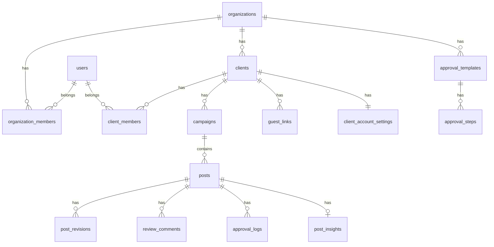

# Phase 2 インサイト管理・レポート機能 実装計画書

> Phase 1（Step 1〜12）の続き。Step 13〜16 で実装する。

---

## 概要

SNS運用代行業者が現在スプレッドシートで管理している「投稿インサイト（数値記録）」「月次レポート作成」を、Skan上で完結させる機能群。

### ユーザーの現状フロー（スプシ）

```
各SNSのインサイト画面を見る
→ 投稿ごとに数値をスプシに手入力
→ スプシが自動で保存率・ホーム率等を計算
→ 月末にスプシをもとにPowerPoint/PDFに貼り付けてクライアントに提出
```

### 実装後のフロー

```
各SNSのインサイト画面を見る
→ Skan の投稿詳細ページで数値を手入力（1〜2分）
→ インサイトダッシュボードでグラフ・KPI自動表示
→ AIが改善提案を生成
→ 月次レポートページで「PDF出力」ボタン1クリック
```

---

## 4つの実装ステップ

| ステップ | 内容 | 新規パッケージ |
|---------|------|--------------|
| Step 13 | インサイスDB・入力UI | なし |
| Step 14 | インサイトダッシュボード（グラフ） | recharts |
| Step 15 | AI改善提案 | なし（OpenAI既存） |
| Step 16 | 月次PDFレポート生成 | @react-pdf/renderer |

---

## Step 13: インサイスDB・入力UI

### 目的

投稿ごとのSNSインサイス数値を手動入力・保存できるようにする。

### 13-1. DBマイグレーション

#### `post_insights`（投稿インサイス）

投稿1件につき1レコード（公開後に1回計測が基本）。

```sql
CREATE TABLE public.post_insights (
  id UUID PRIMARY KEY DEFAULT gen_random_uuid(),
  post_id UUID NOT NULL UNIQUE REFERENCES public.posts(id) ON DELETE CASCADE,
  client_id UUID NOT NULL REFERENCES public.clients(id) ON DELETE CASCADE,

  -- 基本インサイス（手入力）
  followers_count INTEGER,          -- フォロワー数（計測時点）
  reach INTEGER,                    -- リーチ数
  saves INTEGER,                    -- 保存数
  follower_reach INTEGER,           -- フォロワーリーチ数
  non_follower_reach INTEGER,       -- フォロワー外リーチ数
  profile_visits INTEGER,           -- プロフアクセス数
  follows INTEGER,                  -- フォロー数
  web_taps INTEGER,                 -- WEBタップ数
  discovery INTEGER,                -- 発見経由数

  -- 分析メタ（手入力）
  target_segment TEXT,              -- ターゲット
  genre TEXT,                       -- ジャンル
  theme TEXT,                       -- テーマ
  memo TEXT,                        -- 仮説・フィードバックメモ

  -- 派生指標（DBに保存・自動計算）
  -- アプリ側でINSERT/UPDATE時に計算して保存
  save_rate NUMERIC(6, 4),          -- 保存率 = saves / reach
  home_rate NUMERIC(6, 4),          -- ホーム率 = follower_reach / followers_count
  profile_visit_rate NUMERIC(6, 4), -- プロフ遷移率 = profile_visits / reach
  follower_conversion_rate NUMERIC(6, 4), -- フォロワー転換率 = follows / profile_visits
  web_tap_rate NUMERIC(6, 4),       -- WEBタップ率 = web_taps / reach

  recorded_by UUID REFERENCES public.users(id),
  recorded_at TIMESTAMPTZ NOT NULL DEFAULT now(),
  created_at TIMESTAMPTZ NOT NULL DEFAULT now(),
  updated_at TIMESTAMPTZ NOT NULL DEFAULT now()
);

CREATE INDEX idx_post_insights_post ON public.post_insights(post_id);
CREATE INDEX idx_post_insights_client ON public.post_insights(client_id);
CREATE INDEX idx_post_insights_recorded_at ON public.post_insights(recorded_at);

CREATE TRIGGER set_post_insights_updated_at
  BEFORE UPDATE ON public.post_insights
  FOR EACH ROW EXECUTE FUNCTION public.update_updated_at();

ALTER TABLE public.post_insights ENABLE ROW LEVEL SECURITY;
CREATE POLICY "insights_select" ON public.post_insights FOR SELECT USING (public.can_access_client(client_id));
CREATE POLICY "insights_insert" ON public.post_insights FOR INSERT WITH CHECK (public.can_access_client(client_id));
CREATE POLICY "insights_update" ON public.post_insights FOR UPDATE USING (public.can_access_client(client_id)) WITH CHECK (public.can_access_client(client_id));
CREATE POLICY "insights_delete" ON public.post_insights FOR DELETE USING (public.can_access_client(client_id));
```

#### `client_account_settings`（クライアントアカウント設定）

SNS運用設計の情報。ペルソナ・ベンチマーク等を管理。

```sql
CREATE TABLE public.client_account_settings (
  id UUID PRIMARY KEY DEFAULT gen_random_uuid(),
  client_id UUID NOT NULL UNIQUE REFERENCES public.clients(id) ON DELETE CASCADE,

  -- アカウント基本情報
  profile_text TEXT,                 -- プロフ文
  caption_template TEXT,             -- キャプションテンプレ
  hashtag_sets JSONB DEFAULT '[]',   -- ハッシュタグセット [{label, tags[]}]

  -- アカウント設計
  persona TEXT,                      -- アカウントペルソナ（詳細）
  kpi_save_rate_target NUMERIC(6, 4) DEFAULT 0.02,    -- 保存率目標（デフォルト2%）
  kpi_home_rate_target NUMERIC(6, 4) DEFAULT 0.40,    -- ホーム率目標（デフォルト40%）

  -- ベンチマークアカウント
  benchmark_accounts JSONB DEFAULT '[]',  -- [{url, note}]
  competitor_accounts JSONB DEFAULT '[]', -- [{url, note}]

  -- コンテンツネタリスト
  content_ideas JSONB DEFAULT '[]',  -- [{genre, topic, answer, memo, image_url}]

  updated_by UUID REFERENCES public.users(id),
  created_at TIMESTAMPTZ NOT NULL DEFAULT now(),
  updated_at TIMESTAMPTZ NOT NULL DEFAULT now()
);

CREATE TRIGGER set_client_account_settings_updated_at
  BEFORE UPDATE ON public.client_account_settings
  FOR EACH ROW EXECUTE FUNCTION public.update_updated_at();

ALTER TABLE public.client_account_settings ENABLE ROW LEVEL SECURITY;
CREATE POLICY "account_settings_select" ON public.client_account_settings FOR SELECT USING (public.can_access_client(client_id));
CREATE POLICY "account_settings_insert" ON public.client_account_settings FOR INSERT WITH CHECK (public.can_access_client(client_id));
CREATE POLICY "account_settings_update" ON public.client_account_settings FOR UPDATE USING (public.can_access_client(client_id)) WITH CHECK (public.can_access_client(client_id));
```

---

### 13-2. API Route

#### インサイス CRUD

| メソッド | パス | 説明 |
|---------|------|------|
| GET | `/api/clients/[clientId]/posts/[postId]/insights` | インサイス取得（なければ null） |
| POST | `/api/clients/[clientId]/posts/[postId]/insights` | インサイス新規作成（upsert） |
| PATCH | `/api/clients/[clientId]/posts/[postId]/insights` | インサイス更新 |

#### アカウント設定

| メソッド | パス | 説明 |
|---------|------|------|
| GET | `/api/clients/[clientId]/account-settings` | アカウント設定取得 |
| PUT | `/api/clients/[clientId]/account-settings` | 作成 or 全更新（upsert） |

#### 月次サマリー（分析用）

| メソッド | パス | 説明 |
|---------|------|------|
| GET | `/api/clients/[clientId]/insights/summary?year=2026&month=3` | 月次集計データ取得 |

---

### 13-3. 派生指標の計算ロジック

```typescript
// lib/insights/metrics.ts

export type InsightsInput = {
  followers_count: number | null;
  reach: number | null;
  saves: number | null;
  follower_reach: number | null;
  non_follower_reach: number | null;
  profile_visits: number | null;
  follows: number | null;
  web_taps: number | null;
};

export type DerivedMetrics = {
  save_rate: number | null;         // saves / reach（目標: 0.02 = 2%）
  home_rate: number | null;         // follower_reach / followers_count（目標: 0.40 = 40%）
  profile_visit_rate: number | null;// profile_visits / reach
  follower_conversion_rate: number | null; // follows / profile_visits
  web_tap_rate: number | null;      // web_taps / reach
};

export function calcDerivedMetrics(input: InsightsInput): DerivedMetrics {
  const safe = (n: number | null, d: number | null): number | null =>
    n != null && d != null && d !== 0 ? n / d : null;

  return {
    save_rate: safe(input.saves, input.reach),
    home_rate: safe(input.follower_reach, input.followers_count),
    profile_visit_rate: safe(input.profile_visits, input.reach),
    follower_conversion_rate: safe(input.follows, input.profile_visits),
    web_tap_rate: safe(input.web_taps, input.reach),
  };
}

// KPI達成度の判定
export function getKpiStatus(
  value: number | null,
  target: number,
  goodThreshold = 0.8 // 目標の80%以上で「あと少し」
): "good" | "warning" | "poor" | "no_data" {
  if (value == null) return "no_data";
  if (value >= target) return "good";
  if (value >= target * goodThreshold) return "warning";
  return "poor";
}
```

---

### 13-4. インサイス入力UI

**配置**: 投稿詳細ページ（`/clients/[clientId]/posts/[postId]`）にタブを追加。

```
[投稿詳細] [インサイス入力] [プレビュー] [修正コメント]
           ^^^^^^^^^^^^^^^^^^^
           ここを追加
```

**インサイス入力フォームのレイアウト**:

```
┌─────────────────────────────────────────────────────────┐
│ インサイス入力                           [保存済み: 3/5] │
├──────────────────────────┬──────────────────────────────┤
│ 基本数値                  │ 自動計算指標                  │
│                           │                              │
│ フォロワー数     [    ]   │ 保存率        12.3%  [  良 ] │
│ リーチ数        [    ]   │ ← 目標 2.0%                  │
│ 保存数          [    ]   │                              │
│ フォロワーリーチ  [    ]   │ ホーム率       38.5%  [注意] │
│ フォロワー外リーチ [   ]   │ ← 目標 40.0%               │
│ プロフアクセス   [    ]   │                              │
│ フォロー数       [    ]   │ プロフ遷移率    5.2%          │
│ WEBタップ数      [    ]   │                              │
│ 発見経由数       [    ]   │ フォロワー転換率  18.0%       │
│                           │                              │
├──────────────────────────┤ WEBタップ率    0.8%           │
│ 分析メモ                  │                              │
│ ターゲット [          ]   └──────────────────────────────┤
│ ジャンル   [          ]                                  │
│ テーマ     [          ]                                  │
│ メモ（仮説・FB）                                         │
│ [                                   ]                   │
│                                                         │
│                                   [インサイスを保存]     │
└─────────────────────────────────────────────────────────┘
```

**コンポーネント構成**:

```
components/insights/
  insights-form.tsx         -- 入力フォーム本体（"use client"）
  derived-metrics-panel.tsx -- 自動計算指標の表示パネル（リアルタイム更新）
  kpi-badge.tsx             -- KPI達成度バッジ（良/注意/要改善）
```

### 13-5. 完了条件

- [ ] `post_insights` マイグレーション適用
- [ ] `client_account_settings` マイグレーション適用
- [ ] インサイス入力フォームから保存できる
- [ ] 入力中にリアルタイムで派生指標が更新される
- [ ] KPI達成バッジ（良/注意/要改善）が正しく表示される
- [ ] 未入力の場合はフォームが空の状態で表示される
- [ ] clientロールはインサイス閲覧のみ（編集不可）

---

## Step 14: インサイスダッシュボード（グラフ）

### 目的

クライアントごとの月次インサイスを可視化し、代理店・クライアント双方が「数値の流れ」をひと目で把握できるようにする。

### 14-1. 新規パッケージ

```bash
pnpm add recharts
```

Recharts を選ぶ理由:
- React 19 対応
- SSR/RSC との親和性が高い（"use client" で使う）
- shadcn/ui の Chart コンポーネントが Recharts ベース
- TypeScript 定義が充実

### 14-2. 新規ページ・URL

| パス | 説明 | アクセス |
|------|------|---------|
| `/clients/[clientId]/insights` | 月次インサイスダッシュボード | 企業管理者 / スタッフ / クライアント |

### 14-3. ダッシュボードのレイアウト

```
┌─────────────────────────────────────────────────────────────┐
│ インサイスダッシュボード                    [← 2月] [3月 →] │
├────────────┬────────────┬────────────┬───────────────────────┤
│ 月間リーチ  │ 平均保存率  │ 平均ホーム率│ 投稿数                 │
│ 84,230     │ 3.2%       │ 42.1%      │ 12                    │
│ ↑ +12%    │ 目標2% 達成│ 目標40% 達成│                       │
├────────────┴────────────┴────────────┴───────────────────────┤
│ リーチ・保存数 推移（折れ線グラフ）                           │
│                                                              │
│ 10000 ┤                      ●                              │
│  8000 ┤          ●       ●       ●                          │
│  6000 ┤      ●       ●               ●                      │
│  4000 ┤  ●                               ●                  │
│       └──┬──┬──┬──┬──┬──┬──┬──┬──┬──┬──┬──                 │
│         3/1  3/5  3/10  3/15  3/20  3/25  3/31              │
│                                                              │
│                    [リーチ ●] [保存数 ●] [フォロー数 ●]      │
├─────────────────────────────────────────────────────────────┤
│ 指標別 レーダーチャート（平均値 vs 目標値）                    │
│                                                              │
│         保存率                                               │
│           ●                                                  │
│    ホーム率   プロフ遷移率                                    │
│  ●               ●                                          │
│    WEBタップ  フォロワー転換                                  │
│           ●                                                  │
│                                                              │
├─────────────────────────────────────────────────────────────┤
│ 投稿別インサイス一覧                              [CSVエクスポート] │
│                                                              │
│ タイトル     | リーチ | 保存率 | ホーム率 | プロフ遷移 | メモ  │
│ ──────────── | ────── | ────── | ──────── | ────────── | ──── │
│ ○○の投稿    | 8,230 | 3.2% ↑ | 41% ↑   | 5.1%       | ...  │
│ △△リール    | 12,100| 5.8% ↑ | 38% ↓   | 4.2%       | ...  │
└─────────────────────────────────────────────────────────────┘
```

### 14-4. コンポーネント構成

```
app/(dashboard)/clients/[clientId]/insights/
  page.tsx                    -- Server Component（データ取得）
  insights-dashboard-client.tsx -- Client Component（グラフ描画）

components/insights/
  reach-trend-chart.tsx       -- リーチ推移折れ線グラフ（Recharts）
  metrics-radar-chart.tsx     -- 指標レーダーチャート（Recharts）
  kpi-summary-cards.tsx       -- 月次KPIサマリーカード（4枚）
  post-insights-table.tsx     -- 投稿別インサイス一覧テーブル
  month-picker.tsx            -- 月選択コントロール
```

### 14-5. サマリー計算ロジック

```typescript
// lib/insights/summary.ts

type MonthlySummary = {
  total_reach: number;
  total_saves: number;
  avg_save_rate: number | null;
  avg_home_rate: number | null;
  avg_profile_visit_rate: number | null;
  avg_follower_conversion_rate: number | null;
  post_count: number;
  posts_with_data_count: number;
};

// 前月比の計算
type MonthlyComparison = {
  current: MonthlySummary;
  previous: MonthlySummary;
  reach_change_pct: number | null;    // (current - previous) / previous
  save_rate_change: number | null;    // current - previous（パーセントポイント差）
};
```

### 14-6. サイドバーへの追加

```
ワークスペース
  概要
  企画
  投稿一覧
  カレンダー
  インサイス   ← 追加
  チーム
```

### 14-7. 完了条件

- [ ] 月次インサイスダッシュボードページが表示される
- [ ] リーチ推移折れ線グラフが描画される
- [ ] KPIサマリーカード（月間リーチ・平均保存率・平均ホーム率・投稿数）が表示される
- [ ] レーダーチャートで目標値との比較が表示される
- [ ] 投稿別インサイス一覧テーブルが表示される
- [ ] 月選択で過去の月のデータを確認できる
- [ ] インサイス未入力の投稿はハイライト（まだ入力なし）で表示される
- [ ] サイドバーに「インサイス」リンクが追加される

---

## Step 15: AI改善提案

### 目的

入力されたインサイス数値をもとに、OpenAI gpt-4o-mini で投稿単位の改善提案を生成する。

### 15-1. API Route

```
POST /api/clients/[clientId]/posts/[postId]/insights/suggest
```

**リクエスト**: インサイスデータ（post_insights の内容）+ 投稿情報（タイトル・キャプション・投稿種別）

**レスポンス**:
```json
{
  "suggestions": [
    {
      "category": "caption",
      "title": "冒頭1行の改善",
      "body": "保存率が目標の2%を大きく上回っている一方、ホーム率が38.5%と目標40%をわずかに下回っています。...",
      "priority": "high"
    },
    {
      "category": "visual",
      "title": "サムネイルのCTAを強化",
      "body": "発見経由のリーチが全体の32%を占めており、新規リーチへの訴求力が高いです。...",
      "priority": "medium"
    },
    {
      "category": "timing",
      "title": "投稿時間の最適化",
      "body": "フォロワーリーチ率が同ジャンルの平均より低いため、投稿時間の変更を検討してください。...",
      "priority": "low"
    }
  ]
}
```

### 15-2. プロンプト設計

```typescript
// lib/ai/insights-suggest.ts

const SYSTEM_PROMPT = `
あなたはInstagram/TikTokのSNS運用の専門家です。
投稿のインサイス数値を分析し、次回以降の改善提案を3つ出力してください。

## 出力形式
JSON配列で、各要素は以下を含むこと:
- category: "caption" | "visual" | "timing" | "hashtag" | "strategy"
- title: 改善点の見出し（20文字以内）
- body: 具体的な改善提案（100〜150文字）
- priority: "high" | "medium" | "low"

## 注意事項
- 数値に基づいた具体的な指摘をすること
- KPI目標（保存率2%・ホーム率40%）と実績を比較した分析を含めること
- 抽象的なアドバイスは避け、「〇〇の部分を△△に変更する」レベルの具体性で
- 日本語で出力すること
`;
```

### 15-3. UI配置

インサイス入力フォームの下部に配置。

```
┌─────────────────────────────────────────────────────────┐
│ [インサイスを保存]                                        │
│                                                         │
│ AI改善提案                         [提案を生成する ✨]   │
│                                                         │
│ （生成後）                                               │
│ ┌──────────────────────────────────────────────────────┐│
│ │ [高] キャプション改善                                  ││
│ │ 保存率は目標の1.5倍を達成していますが、ホーム率が...   ││
│ └──────────────────────────────────────────────────────┘│
│ ┌──────────────────────────────────────────────────────┐│
│ │ [中] サムネイル強化                                    ││
│ │ 発見経由が全体の32%を占めています。新規流入を...       ││
│ └──────────────────────────────────────────────────────┘│
│ ┌──────────────────────────────────────────────────────┐│
│ │ [低] 投稿時間                                          ││
│ │ フォロワーリーチ率が38%と目標に近いですが...           ││
│ └──────────────────────────────────────────────────────┘│
└─────────────────────────────────────────────────────────┘
```

### 15-4. レート制限

既存の `ai_usage` テーブルを流用。改善提案は1投稿につき3回/日まで。

### 15-5. 完了条件

- [ ] インサイス保存後に「提案を生成する」ボタンが表示される
- [ ] 生成ボタンクリックで3件の改善提案が表示される
- [ ] カテゴリ別アイコン・優先度バッジが表示される
- [ ] ローディング状態が適切に表示される
- [ ] インサイスデータが未入力の場合はボタンが無効化される
- [ ] レート制限に達した場合にメッセージが表示される

---

## Step 16: 月次PDFレポート生成

### 目的

月末に1クリックでクライアントに渡せるPDFレポートを生成する。

### 16-1. 新規パッケージ

```bash
pnpm add @react-pdf/renderer
```

`@react-pdf/renderer` を選ぶ理由:
- Reactコンポーネントのスタイルでレイアウトを記述できる
- サーバーサイド（API Route）でレンダリング可能
- 日本語フォント（Noto Sans JP）をカスタムフォントとして組み込める
- 数式・表・チャートも対応

> **グラフのPDF埋め込み**: Recharts はブラウザ描画のため PDF には埋め込めない。
> 代替として、グラフ部分は SVG を直接 `@react-pdf/renderer` の `Svg` コンポーネントで描画する。

### 16-2. 新規ページ・API

| パス | 説明 |
|------|------|
| `/clients/[clientId]/report` | レポート設定・プレビュー画面 |
| `/api/clients/[clientId]/report/generate?year=2026&month=3` | PDF生成API（ストリームで返す） |

### 16-3. PDFレポートの構成（全ページ）

```
表紙（1ページ）
  - クライアント名・月
  - 代理店ロゴ・名称
  - 作成日

エグゼクティブサマリー（1ページ）
  - 月間KPI達成状況（保存率・ホーム率・リーチ・フォロワー増加数）
  - 前月比
  - 総評コメント（AIまたは手入力）

投稿パフォーマンス一覧（1〜複数ページ）
  - 投稿ごとの数値テーブル
    | 投稿日 | タイトル | 種別 | リーチ | 保存率 | ホーム率 | メモ |
  - 目標値を超えた指標はハイライト

トレンドグラフ（1ページ）
  - リーチ推移（折れ線 SVG）
  - 保存率・ホーム率の推移（折れ線 SVG）

改善提案・次月方針（1ページ）
  - AI生成の改善提案（3件）
  - 次月の運用方針（テキスト入力欄）
  - アカウント設計メモ（ペルソナ・KPI目標）
```

### 16-4. レポート設定画面のUI

```
┌─────────────────────────────────────────────────────────┐
│ 月次レポート生成                                          │
│                                                         │
│ 対象月:  [2026年] [3月 ▼]                              │
│                                                         │
│ レポートに含める項目:                                    │
│ [x] エグゼクティブサマリー                              │
│ [x] 投稿パフォーマンス一覧                              │
│ [x] トレンドグラフ                                      │
│ [x] AI改善提案                                          │
│ [ ] アカウント設計情報                                   │
│                                                         │
│ 次月の運用方針（レポートに追記）:                        │
│ ┌──────────────────────────────────────────────────────┐│
│ │ 来月はリール投稿を週2本に増やし、保存率の向上を...    ││
│ └──────────────────────────────────────────────────────┘│
│                                                         │
│ 総評コメント:                                           │
│ ┌──────────────────────────────────────────────────────┐│
│ │ 3月は全体的に保存率が目標2%を大幅に超えており...      ││
│ └──────────────────────────────────────────────────────┘│
│     [AIで総評を生成 ✨]                                 │
│                                                         │
│                    [PDFをダウンロード ⬇]                │
└─────────────────────────────────────────────────────────┘
```

### 16-5. PDF生成APIの実装方針

```typescript
// app/api/clients/[clientId]/report/generate/route.ts

export async function GET(request: Request, { params }) {
  // 1. 認証チェック（clientロールも閲覧可）
  // 2. クエリパラメータで year, month を取得
  // 3. 対象月の投稿 + インサイスデータを取得
  // 4. アカウント設定・クライアント情報を取得
  // 5. ReportDocument コンポーネントを renderToBuffer()
  // 6. application/pdf として返す

  const pdfBuffer = await renderToBuffer(
    <ReportDocument
      client={client}
      insights={monthlyInsights}
      summary={summary}
      settings={reportSettings}
    />
  );

  return new Response(pdfBuffer, {
    headers: {
      "Content-Type": "application/pdf",
      "Content-Disposition": `attachment; filename="report_${year}_${month}.pdf"`,
    },
  });
}
```

### 16-6. コンポーネント構成

```
components/report/
  report-document.tsx       -- PDFドキュメント本体（@react-pdf/renderer）
  report-cover-page.tsx     -- 表紙
  report-summary-page.tsx   -- エグゼクティブサマリー
  report-posts-table.tsx    -- 投稿パフォーマンス表
  report-chart-page.tsx     -- SVGグラフページ
  report-suggestions-page.tsx -- 改善提案ページ
  report-styles.ts          -- 共通スタイル定義（StyleSheet.create）

lib/report/
  build-report-data.ts      -- PDFに渡すデータの組み立て
  svg-charts.ts             -- SVGベースの折れ線グラフ描画関数

app/(dashboard)/clients/[clientId]/report/
  page.tsx                  -- レポート設定ページ（Server Component）
  report-config-form.tsx    -- 設定フォーム（Client Component）
```

### 16-7. フォント設定

Noto Sans JP を PDF に組み込む:

```typescript
// lib/report/fonts.ts
import { Font } from "@react-pdf/renderer";

Font.register({
  family: "NotoSansJP",
  src: "https://fonts.gstatic.com/ea/notosansjapanese/v6/NotoSansJP-Regular.otf",
});
```

> 本番環境では `public/fonts/` にフォントファイルを置いてローカル参照を推奨。

### 16-8. 完了条件

- [ ] レポート設定ページが表示される
- [ ] 対象月・含める項目を選択できる
- [ ] 総評コメントをAI生成できる
- [ ] 「PDFをダウンロード」でPDFが生成・ダウンロードされる
- [ ] PDFに表紙・サマリー・投稿テーブル・グラフ・改善提案が含まれる
- [ ] 日本語が文字化けしない
- [ ] インサイスデータが0件の月でも「データなし」として出力できる

---

## DB全体のER図（Phase 2 追加分を含む）



---

## 新規API一覧（Phase 2 追加分）

### インサイス管理

| メソッド | パス | 説明 | ロール制限 |
|---------|------|------|----------|
| GET | `/api/clients/[clientId]/posts/[postId]/insights` | インサイス取得 | 全ロール（閲覧） |
| POST | `/api/clients/[clientId]/posts/[postId]/insights` | インサイス作成/更新 | staff / agency_admin / master |
| PATCH | `/api/clients/[clientId]/posts/[postId]/insights` | 部分更新 | staff / agency_admin / master |
| GET | `/api/clients/[clientId]/insights/summary` | 月次集計 | 全ロール |

### アカウント設定

| メソッド | パス | 説明 | ロール制限 |
|---------|------|------|----------|
| GET | `/api/clients/[clientId]/account-settings` | 取得 | 全ロール |
| PUT | `/api/clients/[clientId]/account-settings` | upsert | agency_admin / master |

### AI

| メソッド | パス | 説明 | ロール制限 |
|---------|------|------|----------|
| POST | `/api/clients/[clientId]/posts/[postId]/insights/suggest` | 改善提案生成 | staff / agency_admin / master |
| POST | `/api/clients/[clientId]/report/summary-comment` | 総評コメント生成 | agency_admin / master |

### レポート

| メソッド | パス | 説明 | ロール制限 |
|---------|------|------|----------|
| GET | `/api/clients/[clientId]/report/generate` | PDF生成（ダウンロード） | 全ロール |

---

## 新規URLルーティング（Phase 2 追加分）

| パス | 画面 | アクセス可能ロール |
|------|------|-----------------|
| `/clients/[clientId]/insights` | 月次インサイスダッシュボード | 全ロール |
| `/clients/[clientId]/report` | 月次PDFレポート生成 | 全ロール（DL操作はstaff以上） |
| `/clients/[clientId]/account-settings` | アカウント設計設定 | agency_admin / master |
| `/clients/[clientId]/posts/[postId]` | 投稿詳細（インサイスタブ追加） | 全ロール |

---

## 技術スタック追加分

| 技術 | 用途 |
|------|------|
| recharts | インサイスダッシュボードのグラフ描画 |
| @react-pdf/renderer | 月次PDFレポート生成 |

---

## 実装スケジュール目安

| ステップ | 内容 | 推定工数 |
|---------|------|---------|
| Step 13 | インサイスDB・入力UI | 2日 |
| Step 14 | インサイスダッシュボード（グラフ） | 2日 |
| Step 15 | AI改善提案 | 0.5日 |
| Step 16 | 月次PDFレポート生成 | 3日 |

**Phase 2 合計: 約7.5日（1.5〜2週間）**

---

## 実装時の注意事項

### パフォーマンス
- インサイスダッシュボードのグラフは `"use client"` コンポーネントで描画
- 月次集計データはサーバーサイドで集計してクライアントに渡す（N+1回避）
- PDF生成は Vercel の関数タイムアウト（60秒）に注意。大量データの場合はストリーミング対応を検討

### PDFの日本語フォント
- `@react-pdf/renderer` はデフォルトで日本語非対応
- `Font.register()` で Noto Sans JP を登録する（開発初日に確認）
- フォントファイルは `public/fonts/NotoSansJP-Regular.otf` に配置

### Recharts と SSR
- Recharts は `"use client"` のみで動作。Server Component に直接書かない
- `dynamic(() => import(...), { ssr: false })` は不要（"use client" で充分）

### RLSポリシー
- `post_insights` は既存の `can_access_client()` 関数を流用
- `client_account_settings` も同様
- clientロールからの PATCH/POST/DELETE は APIレベルで 403 を返す
